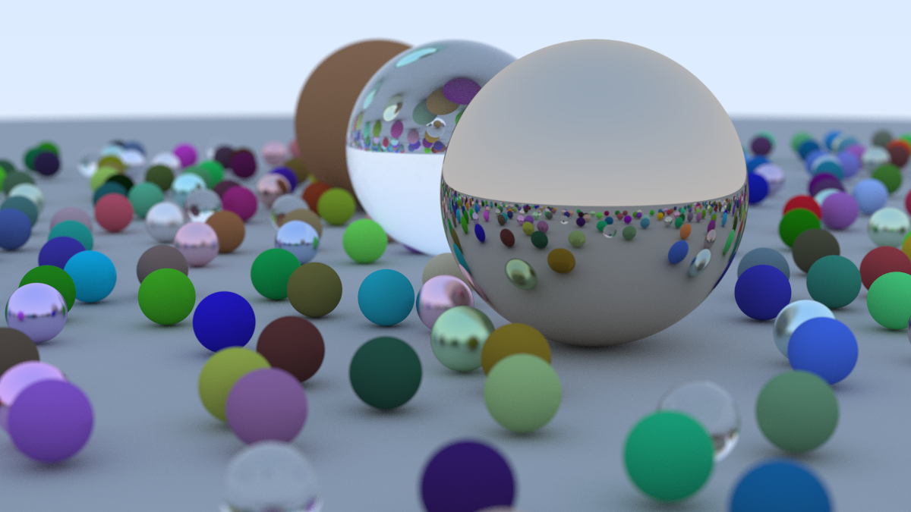

# Ray Tracing in One Weekend, in Rust.

A straightforward Rust-based reimplementation of the basic ray tracer shown in the book [_Ray Tracing in One Weekend_](https://raytracing.github.io/books/RayTracingInOneWeekend.html).

In addition, this version implements its own bitmap export functionality (see [bitmap.rs](/src/bitmap.rs)), and parallelised rendering on the CPU (courtesy of [`rayon`](https://crates.io/crates/rayon)).

